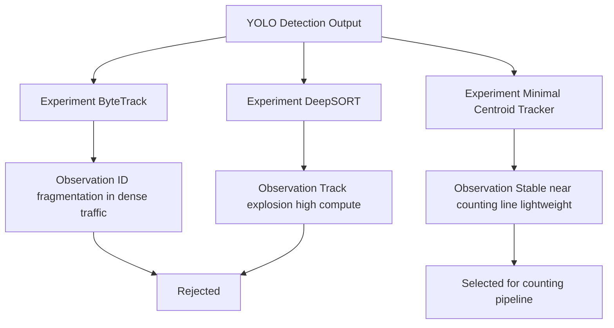

```markdown
# Veh8-v2: Vehicle Detection, Tracking and Traffic Counting System

A modular computer vision pipeline for **real-time vehicle detection, tracking, and line-cross traffic analytics** built on a custom YOLOv8 model and designed for **edge deployment and smart-city traffic monitoring**.

The project demonstrates the full lifecycle of a CV system:

```

video → detection → tracking → counting → analytics

````

---

# Run Demo

chmod +x run_demo.sh
./run_demo.sh <path_to_video>

Example: ./run_demo.sh outputs/test_video.mp4

---

# System Pipeline

This repository implements a modular pipeline that converts raw video streams into structured traffic events.

```mermaid
flowchart TD

A[Input Video or Camera Stream] --> B[Frame Decoder OpenCV]

B --> C[YOLOv8 Vehicle Detector]

C --> D[Frame Detections Bounding Boxes Class Confidence]

D --> E[Tracking Layer Minimal Centroid Tracker]

E --> F[Tracklets Vehicle Centroid Trajectories]

F --> G[Line Crossing Event Detection]

G --> H[Outputs]

H --> H1[Class Wise Vehicle Counts]

H --> H2[Crossing Event Log CSV]

H --> H3[Annotated Debug Video]
````

---

# Project Goals

This project was built to explore:

* Training a **custom multi-class vehicle detection model**
* Evaluating **tracking algorithms under dense traffic**
* Designing a **lightweight event-based counting system**
* Building a **modular computer vision architecture**
* Preparing the pipeline for **Android edge deployment**

---

# Model Overview

Veh8-v2 is a YOLOv8s-based object detection model trained on a hybrid dataset combining structured highway traffic and chaotic urban environments.

**Base model**

* YOLOv8s
* 11.13M parameters
* 28.5 GFLOPs
* Input size: 640×640
* 8 vehicle classes

---

# Vehicle Classes

| ID | Class               |
| -- | ------------------- |
| 0  | auto                |
| 1  | bus                 |
| 2  | car                 |
| 3  | light_motor_vehicle |
| 4  | motorcycle          |
| 5  | multi-axle          |
| 6  | tractor             |
| 7  | truck               |

---

# Dataset Sources

Training data was assembled from multiple datasets to capture diverse traffic patterns.

### Veh8 Dataset

* 6,574 CCTV images
* Primary training dataset

### Indian Driving Dataset (IDD)

* 7,000 filtered vehicle images
* Chaotic urban driving scenes

### BDD100K

* Used in initial checkpoint
* Provides broader driving context

**Total training images**

```
13,574 images
```

Validation:

```
821 images
2,632 labeled instances
```

---

# Validation Performance

### Per-class mAP@0.5

| Class               | AP    |
| ------------------- | ----- |
| auto                | 0.968 |
| bus                 | 0.897 |
| car                 | 0.942 |
| light_motor_vehicle | 0.791 |
| motorcycle          | 0.884 |
| multi-axle          | 0.855 |
| tractor             | 0.960 |
| truck               | 0.787 |

### Aggregate metrics

| Metric       | Value |
| ------------ | ----- |
| Precision    | 0.829 |
| Recall       | 0.833 |
| mAP@0.5      | 0.886 |
| mAP@0.5:0.95 | 0.684 |

---

# Tracking Experiments

The project evaluated multiple tracking approaches to determine the most stable method for line-cross counting.



### Conclusion

For the traffic counting use-case:

**Minimal centroid tracking performed best** because:

* counting requires **stable short-term identity**, not long-term tracking
* algorithm is **lightweight**
* robust near the **counting line region**

---

# Traffic Counting System

Vehicles are counted when their **centroid crosses a configurable line** in the frame.

Features:

* resolution-independent line definition
* configurable direction (top-to-bottom etc.)
* event logging for analytics
* robust to moderate occlusion

Outputs include:

```
vehicle counts
crossing event CSV logs
annotated debug videos
```

---

# Repository Structure

```
src/
  detection/      YOLO detector wrapper
  tracking/       tracking algorithms
  counting/       line crossing logic
  geometry/       frame geometry utilities
  evaluation/     event logger and visualization
  utils/          shared utilities

scripts/
  count_video.py
  render_annotated_video.py

configs/
  tracker.yaml
  counter.yaml

models/
  trained YOLO weights

outputs/
  generated videos and event logs

docs/
  dataset details
  training pipeline
  model card
  experiments and architecture
```

---

# Running the Counting Pipeline

Example:

```
python scripts/count_video.py \
--video input_video.mp4 \
--model models/best_veh8bdd100kidd_v2.1.pt
```

This will produce:

```
class-wise counts
event logs
```

---

# Generating an Annotated Debug Video

```
python scripts/render_annotated_video.py \
--video input_video.mp4 \
--model models/best_veh8bdd100kidd_v2.1.pt
```

Output:

```
outputs/annotated_output.mp4
```

The video includes:

* bounding boxes
* class labels
* confidence scores
* counting line
* live counts

---

# Edge Deployment

The model has also been exported to **TensorFlow Lite** for on-device inference.

| Model          | Size   | Estimated CPU FPS |
| -------------- | ------ | ----------------- |
| Float32 TFLite | ~44 MB | 14–22 FPS         |
| Float16 TFLite | ~22 MB | 20–33 FPS         |

Actual performance depends on device chipset, GPU delegate, and thermal constraints.

---

# Use Cases

* Traffic flow analytics
* Vehicle counting
* Smart city infrastructure
* Edge AI traffic monitoring
* Urban congestion studies

---

# Limitations

* Motorcycle detection remains slightly weaker at strict IoU
* Heavy occlusion may fragment tracks
* Night-time robustness not heavily optimized
* Domain shift possible outside mixed-traffic environments

---

# Ethical Considerations

This system:

* detects **vehicle categories only**
* does **not identify individuals**
* supports **privacy-preserving traffic analytics**
* is suitable for **edge deployment**

---

# Roadmap

Planned improvements include:

* multi-direction junction counting
* stronger motorcycle detection
* low-light training augmentation
* improved edge inference performance
* Android real-time deployment

---

# License

MIT License

```
```
